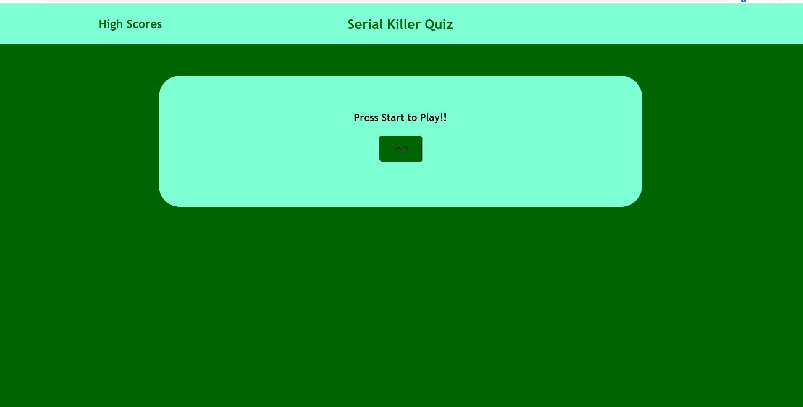
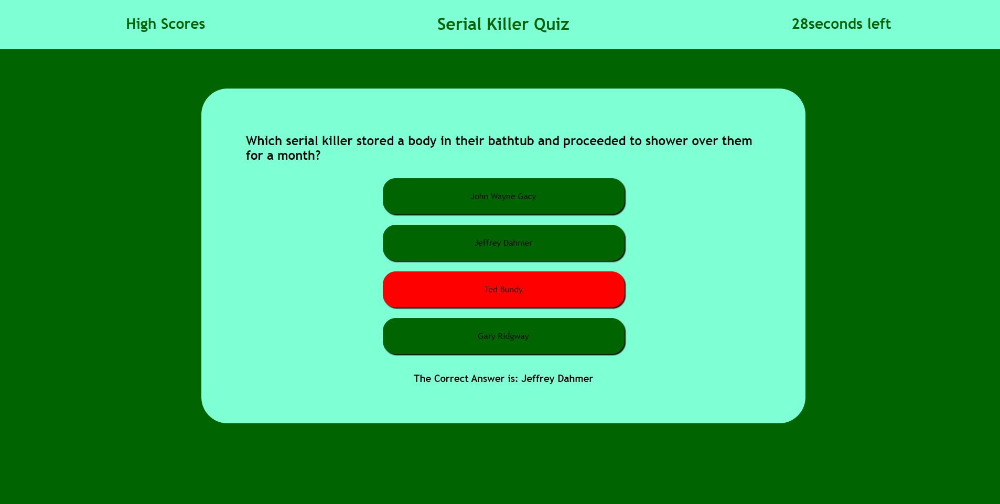
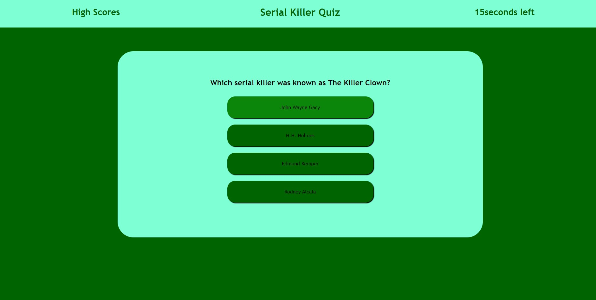
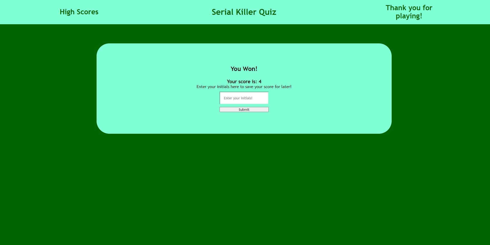
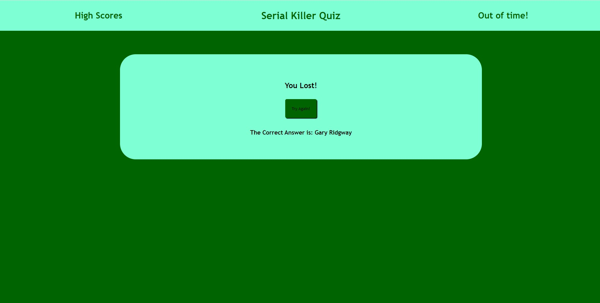
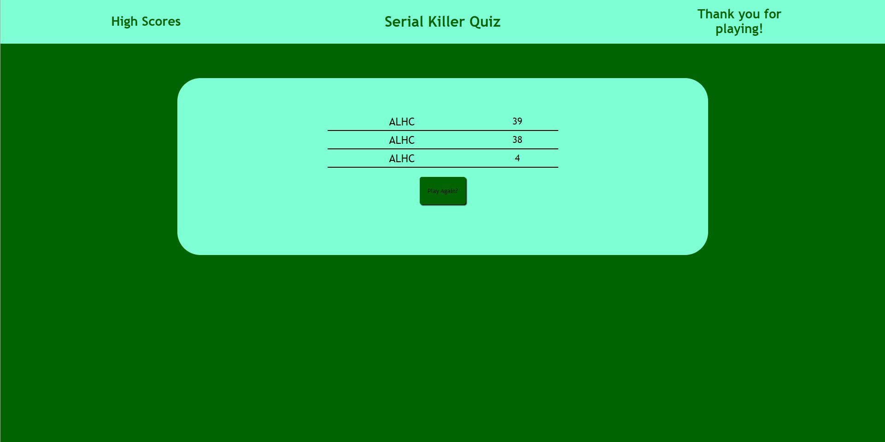

#  Serial Killer Quiz

## Description
I don't know that this will really solve any problems but it sure is fun? I made a Serial Killer Quiz. We were tasked with making a functioning quiz that can save your score within local storage. I definitely learned a lot about using event listeners and of course about local storage. 
## Usage
You can use this to learn a little something about serial killers. 
## Website Link
You can find the link to my deployed site [here!] ()
## Screen Shots
### Start Screen

### During Quiz Wrong Answer

### During Quiz Correct Answer

### Won Screen

### Lose Screen

### High Score Screen

## Credits 
Got a lot of help from https://github.com/alecryanhunter on this one 
## Licensing
MIT